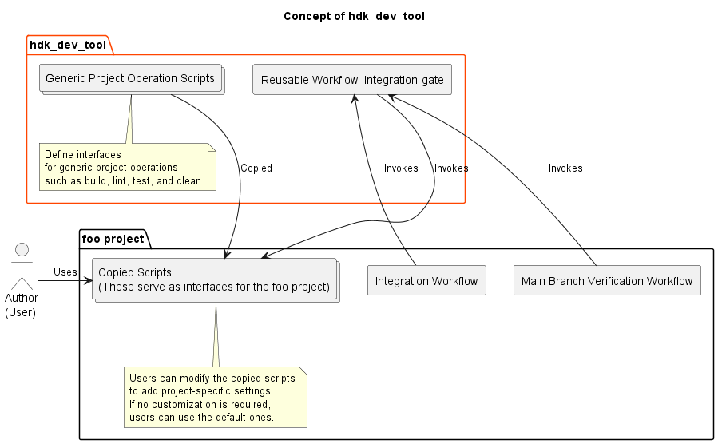
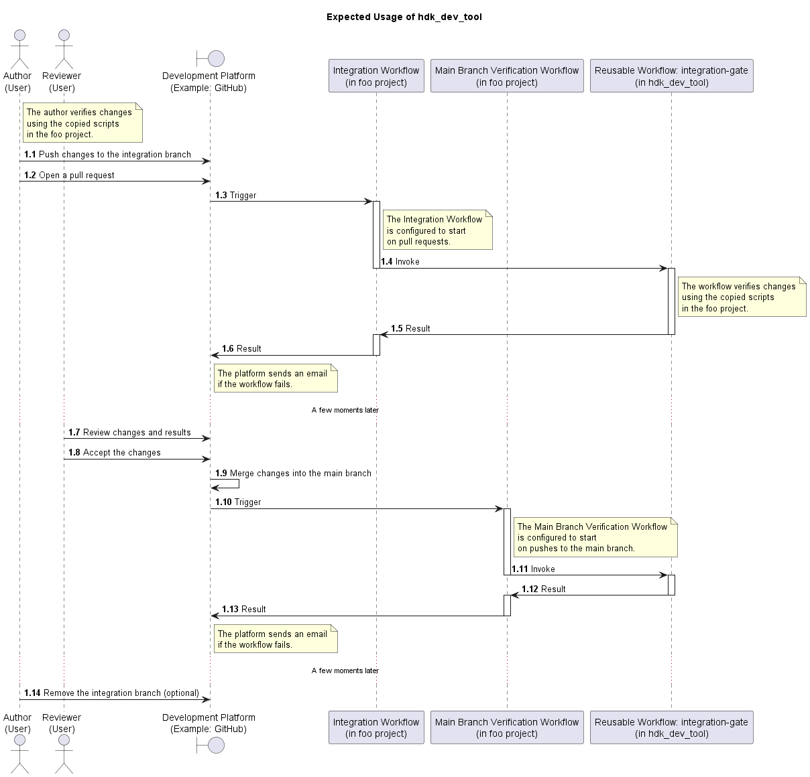

# hdk_dev_tool

A project for developing software development tools.

This project is intended for my projects.  
The figure below illustrates the concept of **hdk_dev_tool**.



## Overview

This repository provides software development tools,
such as reusable workflows and scripts, for various software projects.

Deliverables:  

* A reusable workflow **integration-gate**
* **Generic Project Operation Scripts**

## Usage

The figure below shows an expected usage of **hdk_dev_tool**.



#### Reusable Workflow

You can configure your projects to invoke the reusable workflow
provided by this repository.

###### integration-gate

This workflow verifies the target branch.
It consists of the following steps:

* Checkout
* Setup Environment
* Build
* Lint
* Test

In the **Setup Environment** step, tools such as GoogleTest and Boost are set up as needed.
Whether these tools are installed or not can be specified via parameters of this workflow.

Parameters:

|Item|Description|Mandatory?|Type|Default|
|:---|:---|:---|:---|:---|
|platforms|Platforms in JSON array format|No|string|'["ubuntu-latest", "windows-latest", "macos-latest"]'|
|python-versions|Python versions in JSON array format|No|string|'["3.x"]'|
|build-type-library|Build type for external libraries.<br>One of {Debug, Release, RelWithDebInfo, MinSizeRel}.<br>Keep same with your do_build script|No|string|Debug|
|is-required-googletest|Setup switch for GoogleTest|No|boolean|true|
|is-required-boost|Setup switch for Boost|No|boolean|true|
|is-required-cppcheck|Setup switch for Cppcheck|No|boolean|true|
|is-required-papyrusrt|Setup switch for Papyrus-RT|No|boolean|false|

secrets:

|Item|Description|Mandatory?|
|:---|:---|:---|
|token|Access token that is used for checkout repositories.<br>If target repository contains submodule this workflow requires permission.|No|

To invoke this workflow from your **foo** project, you can define a workflow as follows:

```
name foo

jobs:
  foo:
    uses: Bacondish2023/hdk_dev_tool/.github/workflows/integration-gate.yml@v1.1.0
```

#### Generic Project Operation Scripts

The Generic Project Operation Scripts return exit codes based on execution results:

* `0`: Success
* `1`: Failure

The reusable workflow performs error handling based on these return codes,
allowing CI workflows to fail fast and report errors accurately.

You can copy the Generic Project Operation Scripts into your project
and register them in your repository.
Shell scripts should be registered in the repository with executable permissions.

Example of registering `do_build.sh` in a Git repository:

```sh
git add do_build.sh
git update-index --add --chmod=+x do_build.sh
git commit
```

The Generic Project Operation Scripts are organized by language as shown below.

###### For C/C++ Projects

* hdk_dev_tool/cpp/script/code/
    * do_build.bat
    * do_build.sh
    * do_clean.bat
    * do_clean.sh
    * do_lint.bat
    * do_lint.sh
    * do_test.bat
    * do_test.sh

In C/C++ projects, the `do_lint` scripts require a `lint` target to be defined.
This target is used by the reusable workflow to perform static analysis
and determine the success or failure of the lint step.

If you use the Generic Project Operation Scripts **as-is**, without customization,
it is recommended to define the `lint` target in the top-level
`CMakeLists.txt` file of your project.
If you customize the scripts, this requirement does not necessarily apply.

An example is shown below:

```txt
find_program(CPPCHECK cppcheck REQUIRED)
add_custom_target(lint
    COMMAND ${CPPCHECK}
        --project=${CMAKE_BINARY_DIR}/compile_commands.json
        --std=c++11
        --enable=warning,performance,portability
        --suppress=missingIncludeSystem
        --inconclusive
        --error-exitcode=1
    WORKING_DIRECTORY ${CMAKE_SOURCE_DIR}
)
```

###### For Papyrus-RT Projects

* hdk_dev_tool/papyrusrt/script/code/

###### For Python Projects

* hdk_dev_tool/python/script/code/

## Prerequisites

#### Supported platform

* Linux
* Windows
* MacOS

#### Required Software for Testing

|Item|Description|Manual Installation Required?|
|:---|:---|:---|
|C/C++ Compiler|-|**Yes**|
|CMake|A build tool|**Yes**|
|Ninja|A build tool|**Yes**|
|Boost|A C++ library|**Yes**|
|GoogleTest|A testing framework for unit test|**Yes**|
|Cppcheck|A static source code analysis tool|**Yes**|
|Python 3|-|**Yes**|
|integration_test_plugin|A Python3 package for integration test|No (Installation is performed on build script)|
|Papyrus-RT|A UMR-RT based software development tool<br>Environment variables **PAPYRUSRT_ROOT** and **UMLRTS_ROOT** are also required|**Yes**|
|model_compiler_for_papyrusrt|A build tool for projects using Papyrus-RT|No (Installation is performed on build script)|

The environment variable **PAPYRUSRT_ROOT** must specify the path to the Papyrus-RT directory.  
The environment variable **UMLRTS_ROOT** must specify the path to the RTS library source directory.
In Papyrus-RT v1.0.0, the library is located at `[your_installation_area]/Papyrus-RT/plugins/org.eclipse.papyrusrt.rts_1.0.0.201707181457/umlrts` .

## Document

* [Requirements](document/development/10_requirements/requirements.md)
* [Design](document/development/20_design/design.md)
* [Papyrus-RT: Quick Reference](document/papyrusrt/papyrusrt_v1.0_quick_reference.md)

## License

Copyright (c) 2026 Hidekazu TAKAHASHI  
hdk_dev_tool is free and open-source software licensed under the **MIT License**.
