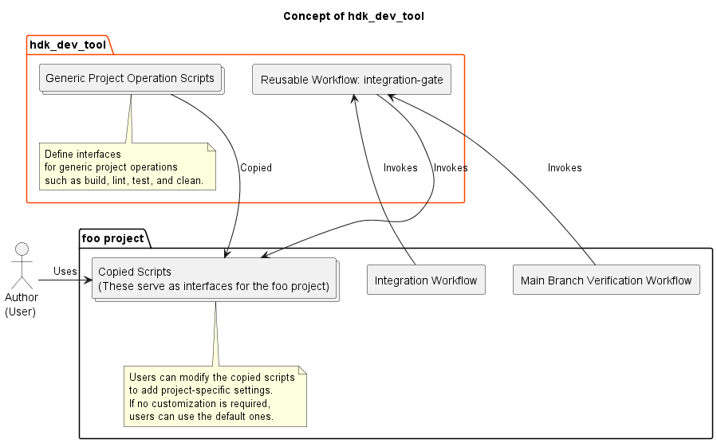
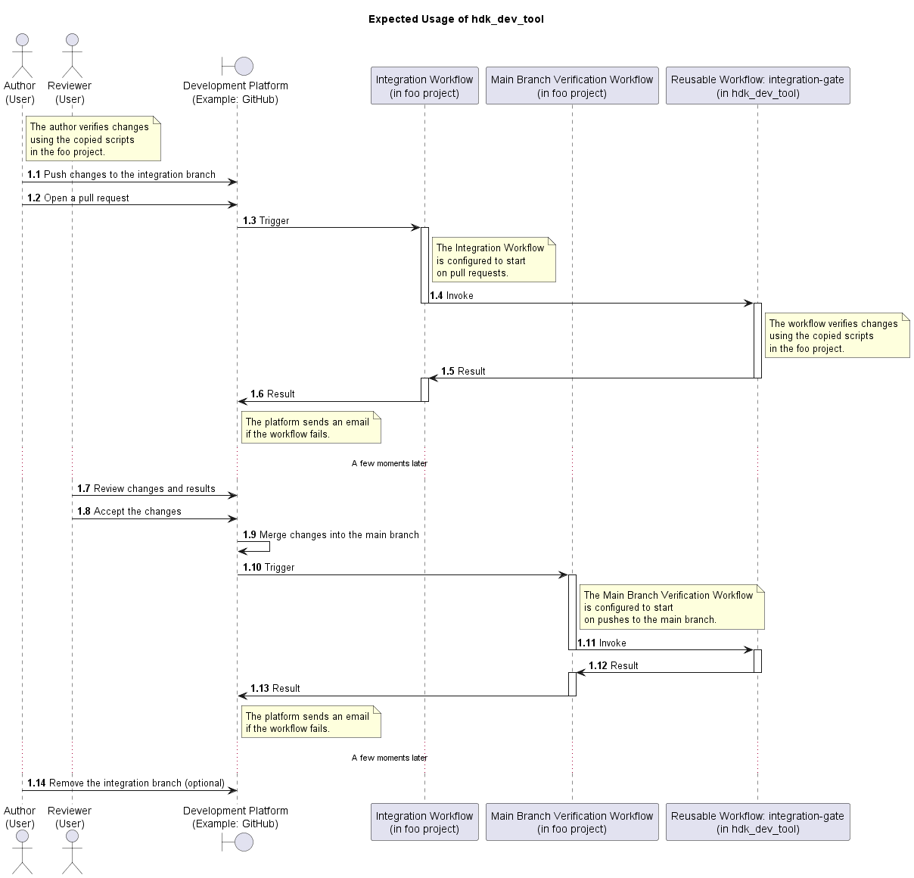

# hdk_dev_tool

A project for creating software development tools.

This project is intended for my own projects.
The figure below illustrates the concept of **hdk_dev_tool**.



## Overview

This repository provides software development tools,
such as reusable workflows and scripts, for various software projects.

Deliverables:  

* A reusable workflow **integration-gate**
* **Generic Project Operation Scripts**

## Usage

The figure below shows an expected usage of **hdk_dev_tool**.



#### Reusable Workflow

You can configure your projects to invoke the reusable workflow
provided by this repository.

###### integration-gate

This workflow verifies the target branch.
It consists of the following steps:

* Checkout
* Setup Environment
* Build
* Lint
* Test

In the **Setup Environment** step, tools such as GoogleTest and Boost are set up as needed.
Whether these tools are installed or not can be specified via parameters of this workflow.

Parameters:

|Item|Description|Mandatory?|Type|Default|
|:---|:---|:---|:---|:---|
|platforms|Platforms in JSON array format|No|string|'["ubuntu-latest", "windows-latest", "macos-latest"]'|
|python-versions|Python versions in JSON array format|No|string|'["3.x"]'|
|build-type-library|Build type for external libraries.<br>One of {Debug, Release, RelWithDebInfo, MinSizeRel}.<br>Keep same with your do_build script|No|string|Debug|
|is-required-googletest|Setup switch for GoogleTest|No|boolean|true|
|is-required-boost|Setup switch for Boost|No|boolean|true|
|is-required-cppcheck|Setup switch for Cppcheck|No|boolean|true|
|is-required-papyrusrt|Setup switch for Papyrus-RT|No|boolean|false|
|is-required-avr8|Setup switch for AVR8 toolchain<br>(Supports Linux and Windows runners only)|No|boolean|false|

secrets:

|Item|Description|Mandatory?|
|:---|:---|:---|
|token|Access token that is used for checkout repositories.<br>If target repository contains submodule this workflow requires permission.|No|

To invoke this workflow from your `foo` project, you can define a workflow as follows:

```
name: foo

on:
  pull_request:
    types:
      - opened
      - synchronize # Pushed to PR branch. The author would push a fix commit to the branch
      - reopened
  workflow_dispatch:

jobs:
  foo:
    uses: Bacondish2023/hdk_dev_tool/.github/workflows/integration-gate.yml@v1.2.2
```

The example above uses the triggers defined in the `on` section
to invoke the workflow when reviewers want to check test results related to a pull request.
In addition, `workflow_dispatch` allows authors to run the workflow
and check its result before creating a pull request.

#### Generic Project Operation Scripts

The Generic Project Operation Scripts are a set of scripts
designed to facilitate common project operations
such as building, cleaning, linting, and testing.

The scripts return exit codes based on execution results:

* `0`: Success
* `1`: Failure

The reusable workflow performs error handling based on these return codes,
allowing CI workflows to fail fast and report errors accurately.

The scripts are implemented as batch files and shell scripts
to support both Windows and Unix-like environments.
You can use `.bat` scripts on Windows and `.sh` scripts on Unix-like environments.

##### Supported Languages

The Generic Project Operation Scripts are organized by language as shown below.

|Language|Details|Script Path|
|:---|:---|:---|
|C/C++|[README](cpp/README.md)|hdk_dev_tool/cpp/script/code/|
|Papyrus-RT|[README](papyrusrt/README.md)|hdk_dev_tool/papyrusrt/script/code/|
|Python|[README](python/README.md)|hdk_dev_tool/python/script/code/|
|Embedded AVR8|[README](embedded/avr8/README.md)|hdk_dev_tool/embedded/avr8/script/code/|

Copy the files from the directory specified in the "Script Path" column above
and integrate them into your project as needed.

##### Integration with User Project

This section describes how to integrate the Generic Project Operation Scripts
into your user project.

For example:

1. Copy the Generic Project Operation Scripts into your project repository.
    * The top-level directory of your project repository is recommended for placing the scripts.
2. Register the shell scripts with executable permissions in the repository.

Example of registering `do_build.sh` in a Git repository:

```sh
git add do_build.sh
git update-index --add --chmod=+x do_build.sh
git commit
```

3. Configure your project to work with the Generic Project Operation Scripts,
   or modify the scripts as needed to fit your project structure.

## Prerequisites

#### Supported platforms

* Linux
* Windows
* MacOS

#### Required Software for Testing

|Item|Description|Manual Installation Required?|
|:---|:---|:---|
|C/C++ Compiler|-|**Yes**|
|CMake|A build tool|**Yes**|
|Ninja|A build tool|**Yes**|
|Boost|A C++ library|**Yes**|
|GoogleTest|A testing framework for unit test|**Yes**|
|Cppcheck|A static source code analysis tool|**Yes**|
|Python 3|-|**Yes**|
|integration_test_plugin|A Python3 package for integration test|No (Installation is performed on build script)|
|Papyrus-RT|A UMR-RT based software development tool<br>Environment variables **PAPYRUSRT_ROOT** and **UMLRTS_ROOT** are also required|**Yes**|
|model_compiler_for_papyrusrt|A build tool for projects using Papyrus-RT|No (Installation is performed on build script)|

The environment variable **PAPYRUSRT_ROOT** must specify the path to the Papyrus-RT directory.  
The environment variable **UMLRTS_ROOT** must specify the path to the RTS library source directory.
In Papyrus-RT v1.0.0, the library is located at `[your_installation_area]/Papyrus-RT/plugins/org.eclipse.papyrusrt.rts_1.0.0.201707181457/umlrts` .

#### Optional Software for Testing

|Item|Description|Manual Installation Required?|
|:---|:---|:---|
|AVR8 toolchain|Toolchain for AVR8 embedded software|**Yes**|

## Document

* Development
    * [Requirements](document/development/10_requirements/requirements.md)
    * [Design](document/development/20_design/design.md)
* [Papyrus-RT: Quick Reference](document/papyrusrt/papyrusrt_v1.0_quick_reference.md)

## License

Copyright (c) 2026 Hidekazu TAKAHASHI  
hdk_dev_tool is free and open-source software licensed under the **MIT License**.
