# Papyrus-RT v1.0 Quick Reference

This document provides a quick reference for Papyrus-RT.
Its purpose is to help users avoid confusion when performing modeling tasks using Papyrus-RT.

* [1 Model Operations](#1-model-operations)
    * [1.1 Model Creation](#11-model-creation)
    * [1.2 Model Opening](#12-model-opening)
* [2 Capsule](#2-capsule)
    * [2.1 Generalization Addition](#21-generalization-addition)
    * [2.2 Operation Addition](#22-operation-addition)
    * [2.3 Virtual Operation](#23-virtual-operation)
    * [2.4 Pure Virtual Operation](#24-pure-virtual-operation)
    * [2.5 Parameter Passing by Pointer](#25-parameter-passing-by-pointer)
    * [2.6 Parameter Passing by Reference](#26-parameter-passing-by-reference)
    * [2.7 Attribute Addition](#27-attribute-addition)
* [3 Passive Class](#3-passive-class)
    * [3.1 Passive Class Creation](#31-passive-class-creation)
    * [3.2 Custom Constructor Definition](#32-custom-constructor-definition)
    * [3.3 Default Constructor Definition](#33-default-constructor-definition)
    * [3.4 Custom Destructor Definition](#34-custom-destructor-definition)
    * [3.5 Default Destructor Definition](#35-default-destructor-definition)


## 1 Model Operations

#### 1.1 Model Creation

This section describes how to create a new Papyrus-RT model.
These steps are used to create a new project.

1. Select `File > New > Papyrus Project`.

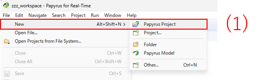

2. Select `UML-RT`.
2. Select `Basic UML-RT Modeling Viewpoint`.
2. Click `Next`.

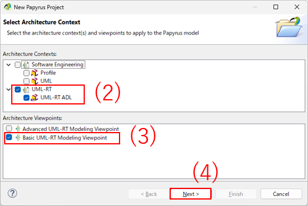

5. Enter the project name.
5. Enter the model location. Any location that can be managed by a VCS such as Git is acceptable.  
   In the test project of this repository, the model is placed under `[project_root]/model`.
5. Click `Next`.

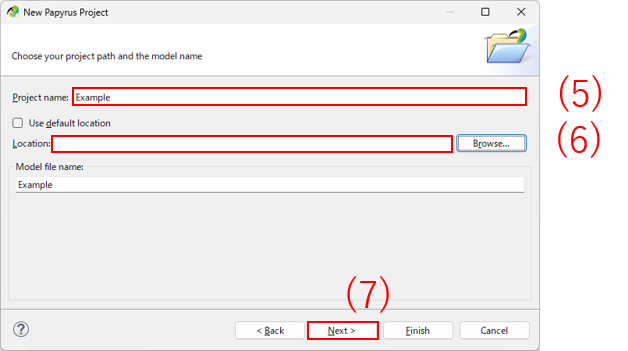

8. Select `UML-RT for C++`.
8. Click `Next`.

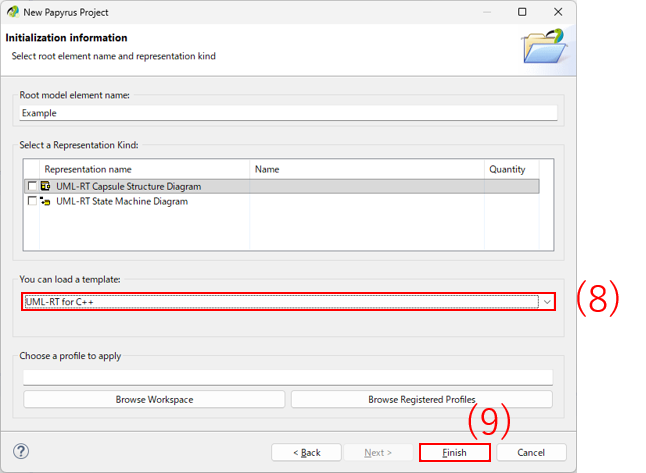

10. The model creation is complete, and an empty model is opened.

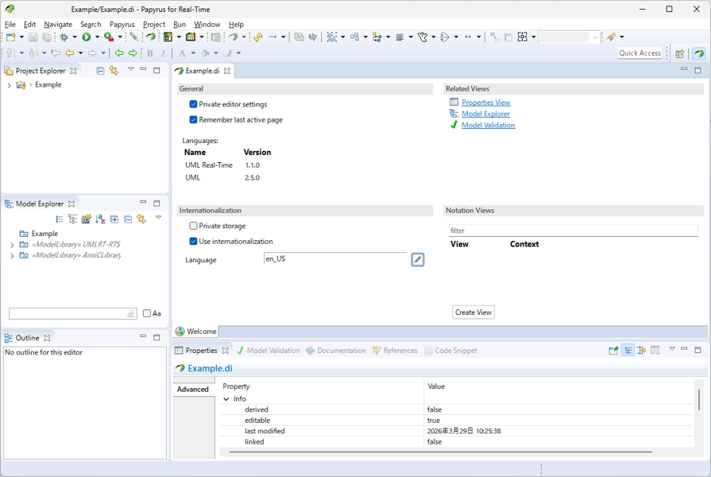

11. The following model files are generated in the model location. Add them to your repository:
    * [model_name].di
    * [model_name].notation
    * [model_name].uml
    * .project

For detailed information such as explanations of available options, refer to:
[Eclipse Wiki: Papyrus-RT User Guide](https://wiki.eclipse.org/Papyrus-RT/User_Guide/Getting_Started)

#### 1.2 Model Opening

This section describes how to open an existing Papyrus-RT model.
These steps are used to open a cloned project.

1. Select `File/Open Projects from File System...`.
1. Enter the import source (e.g., `[project_root]/model`).
1. Click `Finish`.
1. Double-click the project in the Project Explorer.

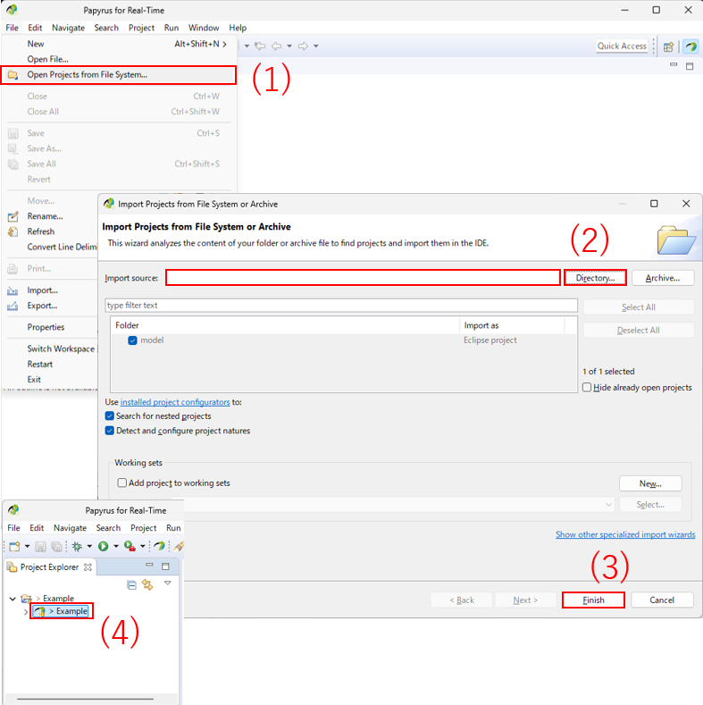


## 2 Capsule

Basic operations are straightforward, so simple procedures are omitted.

#### 2.1 Generalization Addition

1. Select `New Relationship > Generalization`.
1. Select the super element.

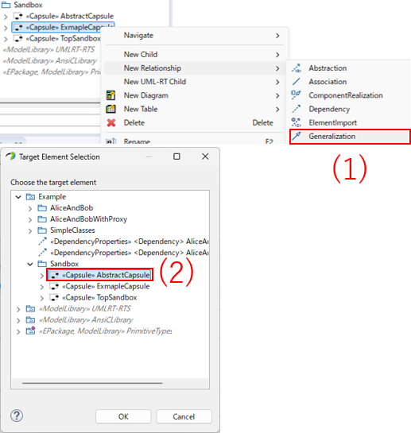

The generated code correctly reflects the inheritance relationship.
The following is an excerpt from the generated `ExampleCapsule.hh`:

```c++
#ifndef EXMAPLECAPSULE_HH
#define EXMAPLECAPSULE_HH

#include "AbstractCapsule.hh"
#include "umlrtcapsuleclass.hh"
#include "umlrtmessage.hh"
struct UMLRTCommsPort;
struct UMLRTSlot;

class Capsule_ExmapleCapsule : public Capsule_AbstractCapsule
{
    ...
```

#### 2.2 Operation Addition

1. Select `New UML-RT Child > Operation`.
1. Enter the name.
1. Select the visibility.
1. Configure parameter settings:
    * Enter the name.
    * Select the direction.
    * Select the type.
1. Configure return value settings:
    * Select direction `return`.
    * Select the type.
1. In the Model Explorer, you can confirm that the `run` operation has parameters and a return value as child elements.

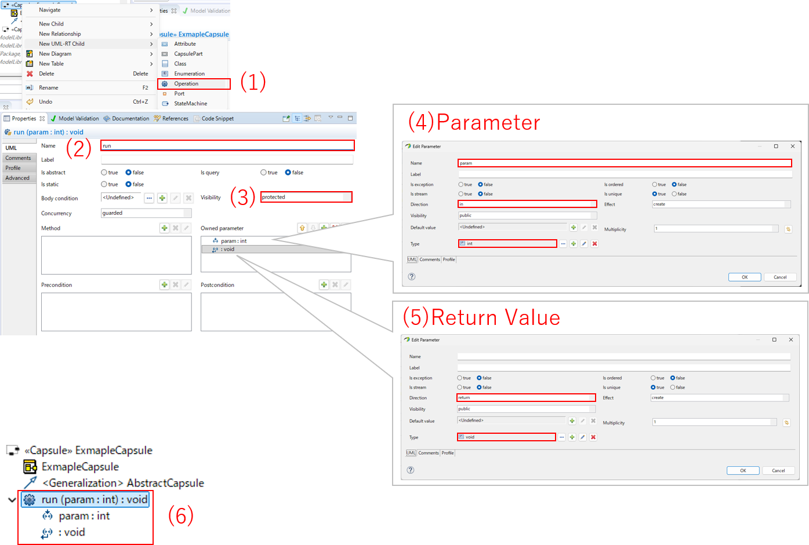

7. Apply properties:
    * Apply `OperationProperties` to the operation.
    * Apply `ParameterProperties` to the parameter and return value.

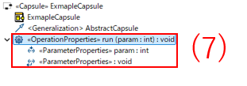

8. Enter the code.

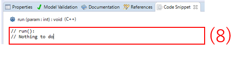

9. After entering the code and saving the model, an `Opaque Behavior` appears in the Model Explorer.
    * This element represents the implementation code.
    * When deleting a function, you must also delete the corresponding `Opaque Behavior`; otherwise, it will remain.

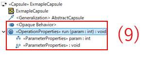

The generated code is as follows:

ExmapleCapsule.hh

```c++
#ifndef EXMAPLECAPSULE_HH
#define EXMAPLECAPSULE_HH
...

class Capsule_ExmapleCapsule : public Capsule_AbstractCapsule
{
public:
    ...
    void run( int param );
```

ExmapleCapsule.cc

```c++
void Capsule_ExmapleCapsule::run( int param )
{
    /* UMLRTGEN-USERREGION-BEGIN file:... */
    // run():
    // Nothing to do
    /* UMLRTGEN-USERREGION-END */
}
```

#### 2.3 Virtual Operation

Apply `OperationProperties` to a operation.
And set `Polymorphic` to true.

The generated code is as follows:

ExmapleCapsule.hh

```c++
#ifndef EXMAPLECAPSULE_HH
#define EXMAPLECAPSULE_HH
...

class Capsule_ExmapleCapsule : public Capsule_AbstractCapsule
{
public:
    ...
    virtual void run( int param );
```

#### 2.4 Pure Virtual Operation

It is not clear how to define a pure virtual operation.

#### 2.5 Parameter Passing by Pointer

Apply `ParameterProperties` to a parameter and configure it as follows:

|Settings|Result|
|:---|:---|
|Set `pointsToType` to true|Pointer type is used|
|Set `pointsToConst` to true|Const pointer type is used|

#### 2.6 Parameter Passing by Reference

Apply `ParameterProperties` to a parameter and specify the type.
For example, specifying `int&` enables passing by reference.

#### 2.7 Attribute Addition

Add an attribute using a type defined in the model.

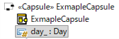

The generated code automatically includes the appropriate header files.
Therefore, it is not necessary to explicitly define dependencies.

ExmapleCapsule.hh

```c++
#ifndef EXMAPLECAPSULE_HH
#define EXMAPLECAPSULE_HH

...
#include "Day.hh"
...

class Capsule_ExmapleCapsule : public Capsule_AbstractCapsule
{
public:
    ...

protected:
    Day day_;
```


## 3 Passive Class

#### 3.1 Passive Class Creation

Create a passive class from the Model Explorer.
Apply `PassiveClassProperties`.

If a passive class has no attributes, the generated code will contain a zero-length array.
On MSVC platforms, this causes the following compilation error:
`error C2466: cannot allocate an array of constant size 0`.

Even when defining a passive class that does not require attributes,
such as an interface-like class, it is necessary to define at least one attribute.

#### 3.2 Custom Constructor Definition

The following methods are available for defining a custom constructor:

| Method | Pros | Cons |
|:---|:---|:---|
| Option 1 | Allows member initializer list to be generated in the constructor implementation | The constructor is not visible in the Model Explorer |
| Option 2 | The constructor can be defined in the same way as a regular operation<br>Therefore, it is visible in the Model Explorer | Mmeber initializer list cannot be used |

###### Option1

Use `PassiveClassProperties` to insert the constructor implementation.

1. Define the constructor declaration in `publicDeclarations`.  
   If you want to change the visibility, use `protectedDeclarations` or `privateDeclarations` as appropriate.
2. Define the constructor implementation in `implementationPreface`.  
   You can also define the member initializer list here.

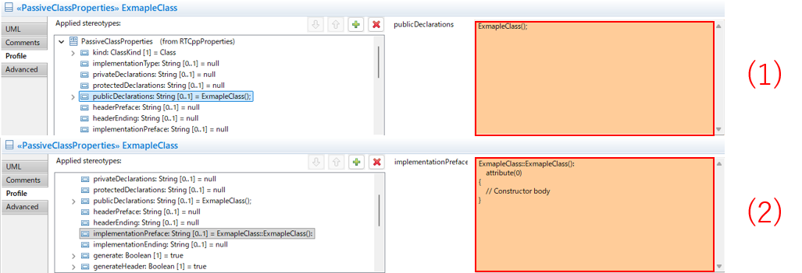

The generated code is as follows:

ExmapleCapsule.hh

```c++
#ifndef EXMAPLECLASS_HH
#define EXMAPLECLASS_HH
...

class ExmapleClass
{
    ...
protected:
    int attribute;
public:
    ExmapleClass();
```

ExmapleCapsule.cc

```c++
ExmapleClass::ExmapleClass():
attribute(0)
{
// Constructor body
}
```

###### Option2

Define the constructor as a regular operation.

Define an operation with the class name and a void return type.
Then, set `ParameterProperties/type` of the return value to a string ignored by the compiler, such as `/* Constructor */`.
This approach allows you to define a constructor.

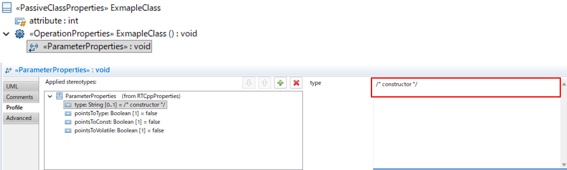

The generated code is as follows:

ExmapleCapsule.hh

```c++
#ifndef EXMAPLECLASS_HH
#define EXMAPLECLASS_HH
...

class ExmapleClass
{
    ...
protected:
    int attribute;
public:
    /* constructor */ ExmapleClass();
```

ExmapleCapsule.cc

```c++
/* constructor */ ExmapleClass::ExmapleClass()
{
    /* UMLRTGEN-USERREGION-BEGIN file:... */
    /* UMLRTGEN-USERREGION-END */
}
```

Attributes must be initialized inside the constructor body.
Member initializer list cannot be used.

#### 3.3 Default Constructor Definition

It is possible to define a default constructor.
However, since the method for initializing attributes is unclear,
it is recommended to define a custom constructor instead.

Apply `PassiveClassProperties` and set `generateDefaultConstructor` to true to generate a default constructor.

The generated code is as follows:

ExmapleClass.hh

```c++
#ifndef EXMAPLECLASS_HH
#define EXMAPLECLASS_HH
...

class ExmapleClass
{
public:
    ExmapleClass();
    ...

protected:
    int attribute;
```

ExmapleClass.cc

```c++
ExmapleClass::ExmapleClass()
{
}
```

Although an initial value was specified for the attribute `attribute` in the model,
no member initializer list was generated.
Therefore, the method for initializing attributes remains unclear.

#### 3.4 Custom Destructor Definition

The same approach as for custom constructors can be used.
See [Custom Constructor Definition](#32-custom-constructor-definition).

#### 3.5 Default Destructor Definition

It is possible to define a default destructor.
However, the method for adding the `virtual` specifier is unclear.
This can be problematic when defining classes with inheritance relationships,
so it is recommended to define a custom destructor instead.

Apply `PassiveClassProperties` and set `generateDestructor` to true to generate a default destructor.

The generated code is as follows:

ExmapleClass.hh

```c++
#ifndef EXMAPLECLASS_HH
#define EXMAPLECLASS_HH
...

class ExmapleClass
{
public:
    ~ExmapleClass();
```

ExmapleClass.cc

```c++
ExmapleClass::~ExmapleClass()
{
}
```
