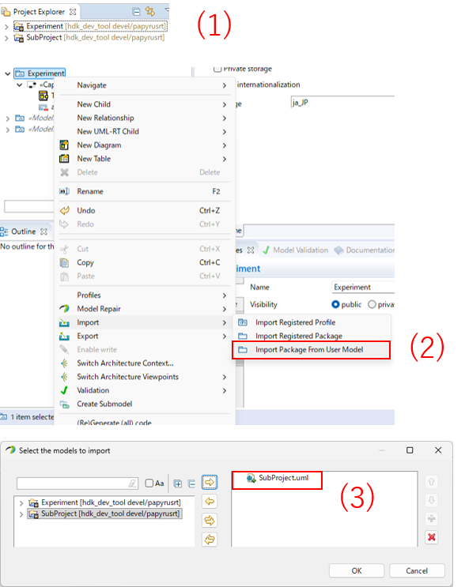
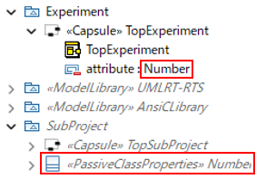

# Experiment

## Type Support

#### Purpose

In Papyrus-RT v1.0, it is possible to use user-defined types such as capsules and classes,
as well as C++ types included in the `AnsiCLibrary` package.
The `AnsiCLibrary` package provides many types such as `int` and `char`,
but there are also C++ types that are not included, such as `size_t` and `std::string`.

To use a type as an attribute or as a parameter of an operation in Papyrus-RT,
it must be defined as a type in the model.
Therefore, in this experiment,
we attempt to define types such as `size_t` and `std::string`,
which are not available by default, by the user.

#### Procedure

In this experiment,
we prototype a type `MySizeT`, which is an alias of `size_t`, in the Papyrus-RT model.

First, we investigated existing methods for defining an alias.
Although the kind setting of `PassiveClassProperties`,
which can be applied to classes, allows selecting `Typedef`,
the generated code showed no difference compared to when `Class` was selected.
From this, it appeared that there is no existing method for defining aliases.

Next, we attempted to define an alias by using the user code insertion feature.
We created a class `MySizeT`.
Then we applied `PassiveClassProperties` and entered the following code:

The `headerPreface` property is set as follows:

```cpp
typedef size_t MySizeT;

extern const UMLRTObject_class UMLRTType_MySizeT;

#if 0 // Does not exist
```

The `headerEnding` property is set as follows:

```cpp
#endif
```

The `implementationPreface` property is set as follows:

```cpp
const UMLRTObject_field MySizeT_fields[] = 
{
    // Define placeholder element that is not used
    // to avoid compilation error caused by zero-length array.
    {
        "placeholder",  // name
        &UMLRTType_int, // desc
        0,  // offset
        1,  // arraySize
        0   // ptrIndirection
    }
};

const UMLRTObject_class UMLRTType_MySizeT = 
{
    UMLRTObjectInitialize<MySizeT>,
    UMLRTObjectCopy<MySizeT>,
    UMLRTObject_decode,
    UMLRTObject_encode,
    UMLRTObjectDestroy<MySizeT>,
    UMLRTObject_fprintf,
    "MySizeT",
    NULL,
    {
        sizeof( MySizeT ),
        0,
        MySizeT_fields
    },
    UMLRTOBJECTCLASS_DEFAULT_VERSION,
    UMLRTOBJECTCLASS_DEFAULT_BACKWARDS
};

#if 0 // Does not exist
```

The `implementationEnding` property is set as follows:

```cpp
#endif
```

The `UMLRTType_MySizeT` instance appears to store
the information required by the RTS to handle the `MySizeT` type.

In this experiment,
since the default operations provided by the RTS seem to work,
operations such as `UMLRTObject_decode`, `UMLRTObject_encode`, and `UMLRTObject_fprintf` were used.

Alternatively, custom implementations can be provided if required.
The function prototypes for custom implementations are shown below:

```cpp
/**
 * @brief Decodes object from byte stream
 * @return A pointer to the next byte after the src
 */
const void *TypeName_decode( const UMLRTObject_class *desc, const void *src, void *dst, int nest );

/**
 * @brief Encodes object into byte stream
 * @return A pointer to the next byte after the dst
 */
void *TypeName_encode( const UMLRTObject_class *desc, const void *src, void *dst, int nest );

/**
 * @brief Prints string representation of the data into the specified stream
 * @return The number of characters
 */
int TypeName_fprintf( FILE *ostream, const UMLRTObject_class *desc, const void *data, int nest, int arraySize );
```

#### Results


* It was confirmed that attributes of type `MySizeT` can be defined. (On `HolderMySizeT` type)
* It was confirmed that the above model can be built successfully.

This demonstrates that user-defined aliases can be integrated into the model.

#### Limitations

* Manual type definition in the model is required.
* It is not clear how to define type aliases that use dynamic memory allocation such as `std::string`.


## Sub-Project Integration

#### Purpose

The goal is to create a reusable package that contains reusable models,
and to enable projects to integrate this package in order to improve development efficiency.

However, the method for handling reusable packages in Papyrus-RT is not clearly documented.
Therefore, in this experiment, we attempt to create a reusable package and integrate it into a project using Papyrus-RT.

#### Procedure

In this experiment, we create:

* a directory `SubProject` that represents a reusable package repository
* a model `Experiment` that uses the reusable package.

Although `SubProject` is simply a directory in this experiment,
it is intended to represent an external repository integrated via Git submodule in a real use case.

First, models are created with the following directory structure:

```
+---Experiment/
|   +---Experiment.di
|   +---Experiment.notation
|   +---Experiment.uml
|
+---SubProject/
    +---SubProject.di
    +---SubProject.notation
    +---SubProject.uml
    +---build_configuration/
        +---top_build_configuration.xml
        +---libSubProject/
            +---libSubProject.xml
```

The SubProject model contains:

* a capsule `TopSubProject`
* a class `Number`

When built, it produces the `libSubProject` library.

To use a reusable package in a Papyrus-RT project,
the package must be imported into the project model.
The import is performed as follows:

1. Open both the `Experiment` model and the `SubProject` model (same as normal model opening).
1. In the Model Explorer, right-click on Experiment and select: `Import > Import Package From User Model`
1. In the wizard, select `SubProject` to complete the import.



After importing, types defined in the `SubProject` model become available in `Experiment`.

For example, adding an attribute of type `Number` (defined in `SubProject`)
to the `TopExperiment` capsule in `Experiment` results in the following:



The models created in this experiment were successfully built using:

* Code generation in Papyrus-RT
* CLI build using `model_compiler_for_papyrusrt`

#### Limitation

The integration method explored in this experiment imposes constraints
on the directory structure of the models.

After adding an attribute of type `Number` to `TopExperiment`, the `Experiment.uml` contains:

```xml
...
<ownedAttribute xmi:type="uml:Property" xmi:id="_V7e_UDmbEfG0O5_HKgIZMg" name="attribute" visibility="private">
  <type xmi:type="uml:Class" href="../SubProject/SubProject.uml#_Dk3KIDmXEfGwbZlAcZB5UQ"/>
</ownedAttribute>
...
```

This indicates that the `Experiment` model references the `SubProject` model
using the path: `../SubProject/SubProject.uml`.
This path appears to be logical (model-based),
rather than strictly reflecting the actual filesystem layout.

For example, consider the following directory structure:

```
+---Experiment/
|   +---Experiment.di
|   +---Experiment.notation
|   +---Experiment.uml
|
+---SubProject/
    +---model/
        +---SubProject.di
        +---SubProject.notation
        +---SubProject.uml
        +---build_configuration/
            +---top_build_configuration.xml
            +---libSubProject/
                +---libSubProject.xml
```

Even in this case, after performing import and adding the `Number` attribute,
the reference path remains: `../SubProject/SubProject.uml`
which does not match the actual filesystem path.

In this situation:

* Code generation within Papyrus-RT works correctly
* However, CLI build using `model_compiler_for_papyrusrt` fails

More specifically,
the failure occurs during execution of the standalone Papyrus-RT code generator used by the CLI tool.

Since CLI build is essential for efficient development,
the directory structure must ensure that model reference paths match the filesystem layout.

To achieve this, the following requirements must be satisfied:

Requirements for the reusable repository

* The repository name must match the model name
* Model files must be located at the root of the repository

Requirements for the consuming repository

* The reusable model must be located at: `../ModelName/ModelName.uml` relative to the consuming model

#### Results

This experiment confirmed the following:

* A reusable package can be integrated into a project that uses it
* The integrated model can be successfully built

In addition,
the following requirements were identified as necessary
to enable successful CLI builds using `model_compiler_for_papyrusrt`:

Requirements for the reusable repository

* The repository name must match the model name
* Model files must be located at the root of the repository

Requirements for the consuming repository

* The reusable model must be located at: `../ModelName/ModelName.uml` relative to the consuming model
