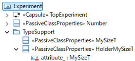

# Experiment

## Type Support

#### Purpose

In Papyrus-RT v1.0, it is possible to use user-defined types such as capsules and classes,
as well as C++ types included in the `AnsiCLibrary` package.
The `AnsiCLibrary` package provides many types such as `int` and `char`,
but there are also C++ types that are not included, such as `size_t` and `std::string`.

To use a type as an attribute or as a parameter of an operation in Papyrus-RT,
it must be defined as a type in the model.
Therefore, in this experiment,
we attempt to define types such as `size_t` and `std::string`,
which are not available by default, by the user.

#### Procedure

In this experiment,
we prototype a type `MySizeT`, which is an alias of `size_t`, in the Papyrus-RT model.

First, we investigated existing methods for defining an alias.
Although the kind setting of `PassiveClassProperties`,
which can be applied to classes, allows selecting `Typedef`,
the generated code showed no difference compared to when `Class` was selected.
From this, it appeared that there is no existing method for defining aliases.

Next, we attempted to define an alias by using the user code insertion feature.
We created a class `MySizeT`.
Then we applied `PassiveClassProperties` and entered the following code:

The `headerPreface` property is set as follows:

```cpp
typedef size_t MySizeT;

extern const UMLRTObject_class UMLRTType_MySizeT;

#if 0 // Does not exist
```

The `headerEnding` property is set as follows:

```cpp
#endif
```

The `implementationPreface` property is set as follows:

```cpp
const UMLRTObject_field MySizeT_fields[] = 
{
    // Define placeholder element that is not used
    // to avoid compilation error caused by zero-length array.
    {
        "placeholder",  // name
        &UMLRTType_int, // desc
        0,  // offset
        1,  // arraySize
        0   // ptrIndirection
    }
};

const UMLRTObject_class UMLRTType_MySizeT = 
{
    UMLRTObjectInitialize<MySizeT>,
    UMLRTObjectCopy<MySizeT>,
    UMLRTObject_decode,
    UMLRTObject_encode,
    UMLRTObjectDestroy<MySizeT>,
    UMLRTObject_fprintf,
    "MySizeT",
    NULL,
    {
        sizeof( MySizeT ),
        0,
        MySizeT_fields
    },
    UMLRTOBJECTCLASS_DEFAULT_VERSION,
    UMLRTOBJECTCLASS_DEFAULT_BACKWARDS
};

#if 0 // Does not exist
```

The `implementationEnding` property is set as follows:

```cpp
#endif
```

The `UMLRTType_MySizeT` instance appears to store
the information required by the RTS to handle the `MySizeT` type.

In this experiment,
since the default operations provided by the RTS seem to work,
operations such as `UMLRTObject_decode`, `UMLRTObject_encode`, and `UMLRTObject_fprintf` were used.

Alternatively, custom implementations can be provided if required.
The function prototypes for custom implementations are shown below:

```cpp
/**
 * @brief Decodes object from byte stream
 * @return A pointer to the next byte after the src
 */
const void *TypeName_decode( const UMLRTObject_class *desc, const void *src, void *dst, int nest );

/**
 * @brief Encodes object into byte stream
 * @return A pointer to the next byte after the dst
 */
void *TypeName_encode( const UMLRTObject_class *desc, const void *src, void *dst, int nest );

/**
 * @brief Prints string representation of the data into the specified stream
 * @return The number of characters
 */
int TypeName_fprintf( FILE *ostream, const UMLRTObject_class *desc, const void *data, int nest, int arraySize );
```

#### Results



* It was confirmed that attributes of type `MySizeT` can be defined. (On `HolderMySizeT` type)
* It was confirmed that the above model can be built successfully.

This demonstrates that user-defined aliases can be integrated into the model.

#### Limitations

* Manual type definition in the model is required.
* It is not clear how to define type aliases that use dynamic memory allocation such as `std::string`.
